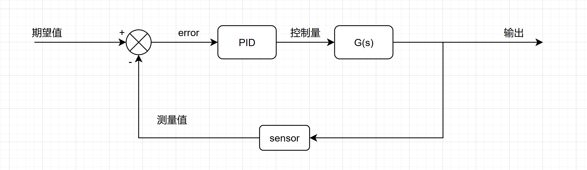
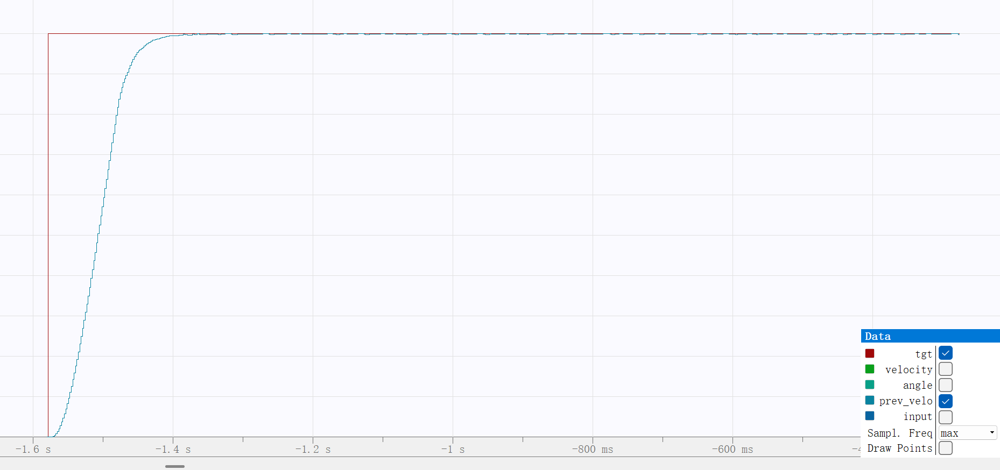
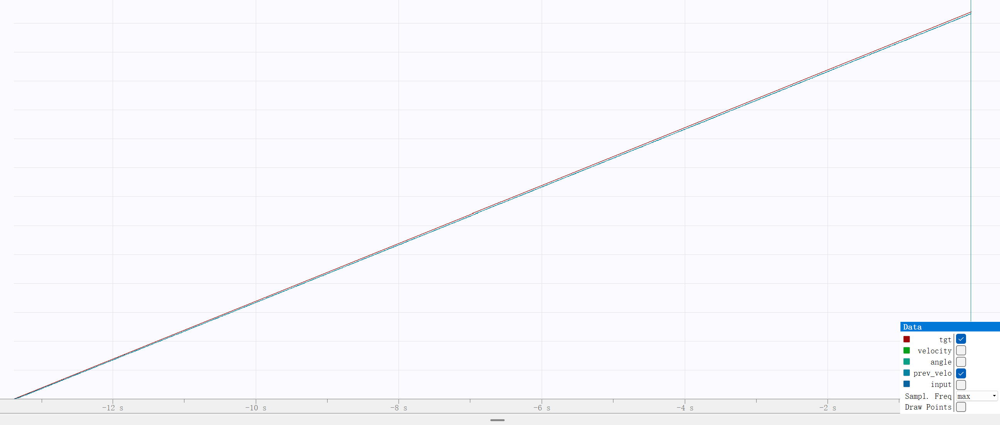
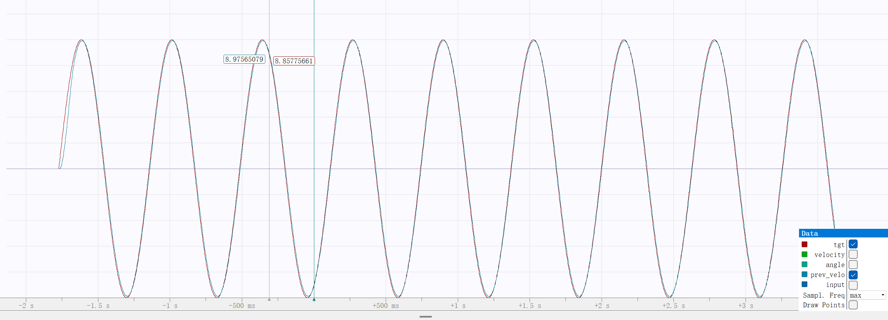
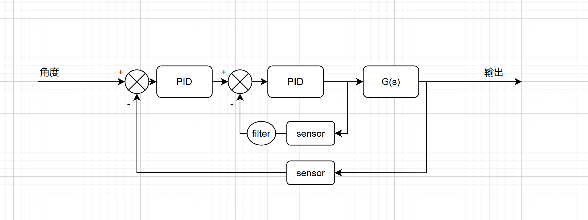
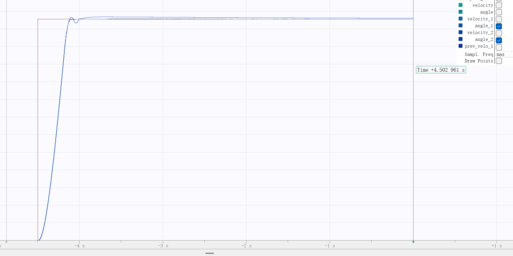
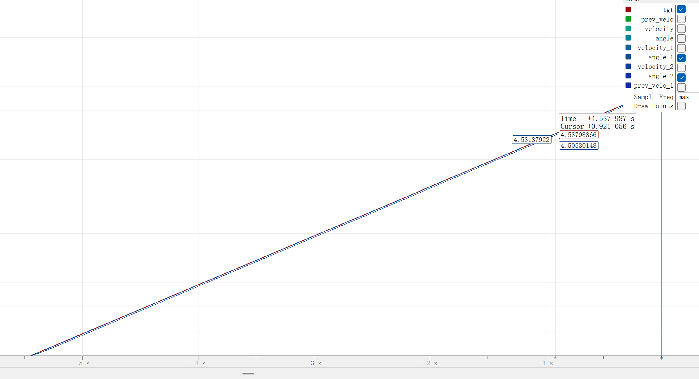
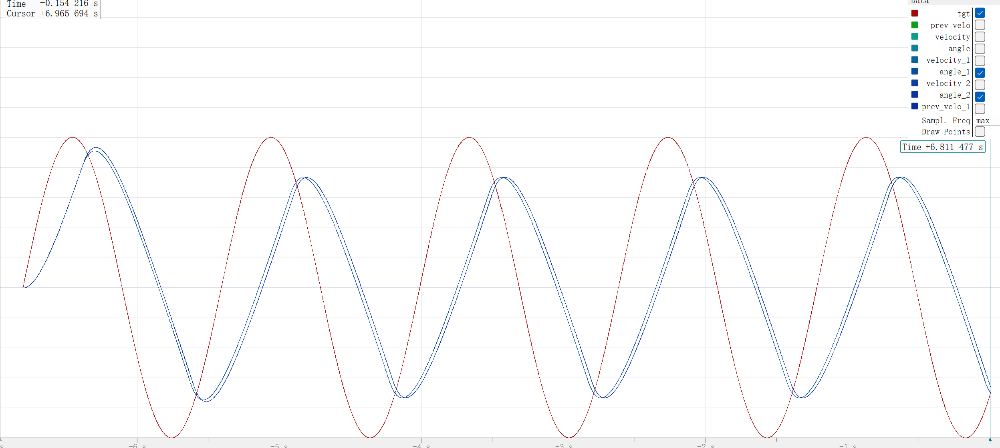

# 电机控制系统仿真实验报告

<center><div style='height:2mm;'></div><div style="font-family:华文楷体;font-size:14pt;">徐浚棠   </div></center>
<center><span style="font-family:华文楷体;font-size:9pt">哈尔滨工程大学创梦之翼战队，电控组，xjt13543870361@163.com<br /></span>

## 八字方针：建模 分析 设计 校验

### 一、建模

#### 1.1 确定传递函数形式

根据说明文档中的内容可以看到，系统是一个电机模型。由于已经给出了电机状态为空载，且根据给出的等效电路图可以得知下列公式：
$$
u(t)=Ri(t)+L \frac {{\rm d}i(t)}{{\rm d}t}+E(t)
$$
其中u是电压，R是电阻，i是电流。电感产生的反电动势是高中物理讲过的电流变化速度，而电机反电动势先单独列出。

进行力学分析能够发现：
$$
T=J \frac {{\rm d}\omega(t)}{{\rm d}t}+b\omega
$$
其中前面项是转动惯量产生的扭矩，后项是转动阻力。

因此，我们不妨将前面的
$
E=K_{\rm e}\omega
$
和
$
T=K_{\rm t}i
$
带入到上面的两个公式。然后将得到的两个新公式通过查表进行拉氏变换获得复频域的公式。在经过消去除
$
\Omega(s)
$
和
$
{\rm I}(s)
$
以外的变量后，我们得到了该电机的传递函数

$$
G_v=\frac {\Omega(s)}{U(s)}=\frac{K_t}{JLs^2+(JR+Lb)s+Rb+K_eK_t}
$$


### 三、设计

#### 3.1 PID控制器的数学表达式

PID控制器分成了三个部分：比例、积分、微分。
数学表达式可以简单描述成下列形式：
$$
G_{\rm PID}=K_pe(t)+K_i\int_0^te(t){\rm d}t+K_d\frac{{\rm d}e(t)}{{\rm d}t}
$$
其中
$
e(t)
$
是误差值关于时间的函数。我们只需要调整该函数中的
$
K_p\space K_i\space K_d
$
三个参数即可获得一个相对可用的PID闭环控制器

#### 3.2 控制器C语言代码

```c
float pid_calc(pid_t *args,float err)
{
    float sum,d_err;
    d_err = err-prev_err;
    intergral_err += err*dt;

    if(intergral_err>(args->integral_top)) intergral_err = args->integral_top;
    else if (intergral_err<(args->integral_bottom)) intergral_err = args->integral_bottom;

    sum = ((args->kp)*err) + ((args->ki)*intergral_err) + ((args->kd)*d_err/dt);
    prev_err = err;
    return sum;
}
```

### 四、校验（最重要）

#### 4.1 速度闭环

##### （1）系统框图



如图，就是基础的pid闭环控制器的结构。

##### （2）关键代码

```c
//使用常量、t、sin(t)为tgt赋值来获得三种响应表现
err = tgt - velocity;
input = pid_calc(&PID_velocity,err);
break;
Motor_Simulation(&Motor,input,dt);
HAL_Delay(1);
```

我使用了简单的低通滤波对速度信号进行降噪，降噪截止频率设置为3hz。详见第五章。

##### （3）阶跃响应时域图



可以看出来我使用~~瞪眼法~~凑试法试出来的pid参数在阶跃输入的情况下还算有一个勉强能看的表现。

##### （4） 斜坡响应时域图



图像中难以看出区别，在到达速度上限前，由于滤波器的存在，斜坡信号也能勉强准确还原。

##### （5）频率响应时域图



通过图像，可以看到10rad/s的正弦输入在他的表现下是相对准确的还原了输入。


#### 4.2 角度闭环

##### （1）系统框图



如图，最简单的串级pid结构。

##### （2）关键代码

```c
//单级pid
err_1 = tgt - angle_1;
input = pid_calc(&PID_a,err);
Motor_Simulation(&Motor_a1,input,dt);

//串级pid
err_2 = tgt - angle_2;
input_2 = pid_calc(&PID_a2,pid_calc(&PID_a1,err_2)-prev_velo_1);
		Motor_Simulation(&Motor_a2,input_2,dt);
```

##### （3）阶跃响应时域图



可以看出，串级pid的调参难度就试凑法来说高很多。我自认相对有一点经验，然而从图中看出，串级pid的输出存在超调，响应也要慢一些。若使用控制理论进行分析，可能会获得比单级pid更好的性能。

##### （4）频率响应时域图



如图，斜坡信号下，两种控制方式的区别不明显。（此处没展示速度曲线，但是应该是因为参数的问题，单级的速度曲线比串级的曲线还平滑。）

##### （5）抗干扰性能时域图



可以看到，两者性能差距并不大，然而串级pid由于结构原因，延迟比单级pid大。也许在参数合适的情况下延迟是串级pid的一大缺陷？

### 五、扩展内容

### 1、复合控制

就我所知，LQR的性能在具有精确数学模型下是极高的。但是我的技术力不允许我尝试这种控制方式了（
也许给我多一些时间获得了传递函数后能尝试使用LQR控制器？
大概会比参数合适的串级pid性能更佳。

### 3、滤波

在首次尝试进行速度闭环时，夸张的传感器噪声吓到我了。在询问学长与查阅资料后，使用c语言简单实现了一个低通滤波。

```c
filter_k=2*Pi*cut_fequency*dt;
//根据模拟时间步进和截止频率获得系数
prev_velo=(velocity*filter_k+prev_velo*(1-filter_k));
//按照公式计算滤波值
```

这个滤波器对我的试凑法调参提供了极大帮助

---

综上，电机控制系统实验报告完毕。